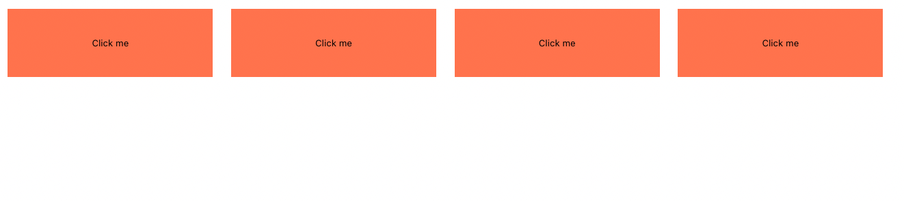

# React Components


## Overview

In this lesson, we'll learn about the fundamentals of building and utilizing components in React. By utilizing what's known as components, we can easily break up our UI into modular pieces of code that we can reuse in multiple places.

## Getting Started

- `Fork` and `Clone` the repository
- `cd` into our newly created directory
- `npm install` to install our dependencies
- `npm start` to spin up our app

## What Are React Components?

By [John Kagga](https://medium.com/the-andela-way/understanding-react-components-37f841c1f3bb)

> Components are the building blocks of any React app and a typical React app will have many of these. Simply put, a component is a JavaScript class or function that optionally accepts inputs i.e. properties(props) and returns a React element that describes how a section of the UI (User Interface) should appear.

From [Educative.io](https://www.educative.io/edpresso/what-is-a-react-component):

> React components let you break up the user interface into separate pieces that can then be reused and handled independently.
> A React component takes an optional input and returns a React element which is rendered on the screen.
> A React component can be either “stateful” or "stateless."

In summary, a React component is a function or class that can recieve or handle some kind of information (props/state) and give us back an interactive element in the DOM.

During our first lesson with React, we utilized the React library to create a simple button that incremented some kind of counter. In that lesson we saw two ways of writing a component:

- `class` based components
- `function` based components

### Class Components

---

Class components are an older method of writing components. Although we won't be using them during this course, they are important to familiarize yourself with.

Pros

- declarative and strict syntax
- individual methods to control the behavior of the component
- one method used to control state

Cons

- tons boiler plate code in order to get set up
- many methods that are all used for one thing

### Function Components

---

Function components were always a popular way of writing of writing components and typically used to build UI elements that were controlled by a class component. With the release of React hooks, we are now able to write all of our components using only the function syntax and manage some kind of state at the same time.

Pros

- easier to set up
- less boilerplate code
- no more confusion on which component should handle logic (for newer developers)

Cons

- most methods now perform more than one thing to control our components behavior
- looser syntax can lead to more bugs
- can cause confusion when writing other functions inside of the component

## Writing Our First Component

Now that we've talked about different kinds of components, it's time to actually write one!

Throughtout this course, we'll be using function based components. Lets start with a basic skeleton of what a function based component would look like:

```jsx
const App = () => {

  return (
    <div></div>
  )
}
```

In your code editor, let's create a folder called `components` inside of the `src` folder. **All of the code you write will always go in the `src` folder.**

Inside of the `components` folder, create a file called `Button.js`.

**Pay special attention to the casing of the file name, all component files will use the `PascalCased` convention.**

**Some developers prefer to use the `.jsx` extension for component files as it can give better syntax highlighting and fancy file icons. `.js` and `.jsx` are interpreted the same in a React project. When in doubt consult your employes style guide on which to use.**


The `import` syntax uses the following structure:

```jsx
import NameForComponent from '../components/FileOfComponent'
```

**Note: This syntax is only used for component files or libraries such as `React`. When importing stylesheets you do not need a variable name**.

Next we'll set up the function for our component. Add the following to `Button.js`:

```js
const Button = () => {}
```

Next, we'll return a `button` element from our `Button` component:

```jsx
const Button = () => {

  return (
    <button>Click Me</button>
  )
}
```

And last step! In order to utilize this component somewhere else in our application, we need to `export` it:

```js
export default Button
```

Final `Button` component:

```jsx
const Button = () => {

  return (
    <button>Click Me</button>
  )
}

export default Button
```


### Utilizing Our Component

Now that we've successfully created a `Button` component, let's display it in our UI!

Open the `App.js` file. Add an `import` statement to the top, this `import` statement is going to handle bringing in our `Button` component:

```js
import Button from './components/Button'
```

**Note: You do not need to use file extensions for `.js` and `.jsx` files in React when importing!**

Next we'll add our `Button` to the current markup in `App.js`:

```jsx
const App = () => {

  return (
    <div>
      <Button />
    </div>
  )
}
```

**Note: Notice the use of `()` in the return statement! This syntax is used when returning multiple elements from a component! Also, notice how we do not use an opening and closing tag for the component itself. The reason for this is because this component is not set up to use `children`. We'll talk more about this when we learn about component props**.

At this point, check your browser and you should see the following button:


### Reusing Components

At this point, we should have a beautiful button displayed on our page. What if we wanted multiple buttons? With React, this is pretty straightforward. We can simply add more of the `Button` component to our markup!

Add the following to the `App.js`:

```jsx
const App = () => {
  
  return (
    <div>
      <Button />
      <Button />
      <Button />
      <Button />
    </div>
  )
}
```

We should now see `4` buttons on our page:



## Recap

In this lesson, we learned how to:

- Create a component
- How a component is structured
- How to import a component
- How to use a component multiple times

Components are crucial building blocks in React. They allow us to build amazing UI's by reusing most of our code. Gone are the days of writing a button over and over again. By using React, we can create one component and utilize it multiple times. Our current button although simple, is a critical foundation going forward.

## Resources

- [React Components](https://reactjs.org/docs/components-and-props.html)
- [Understanding React Components](https://medium.com/the-andela-way/understanding-react-components-37f841c1f3bb)
